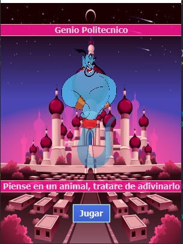

# Genio Politécnico
Genio Politénico is a game built in java 8 with javaFX

## Objective
The objective of the game is that the program try to guess the correct animal with the asks that
he make to the user
